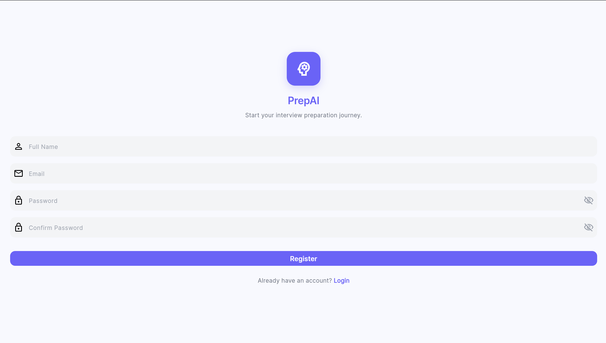
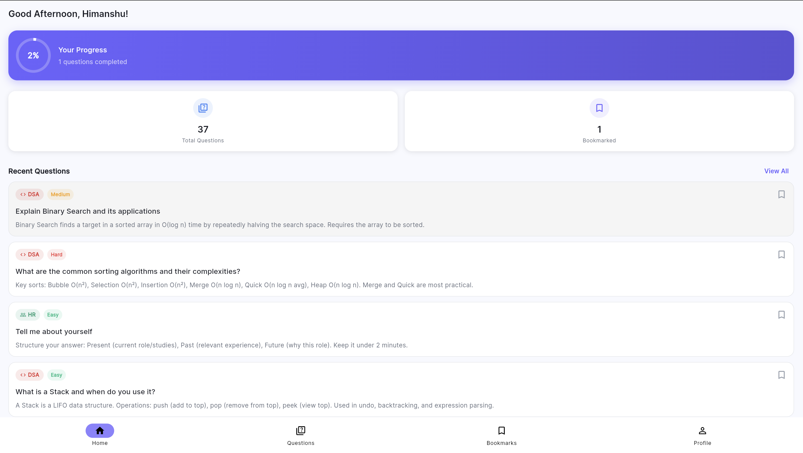
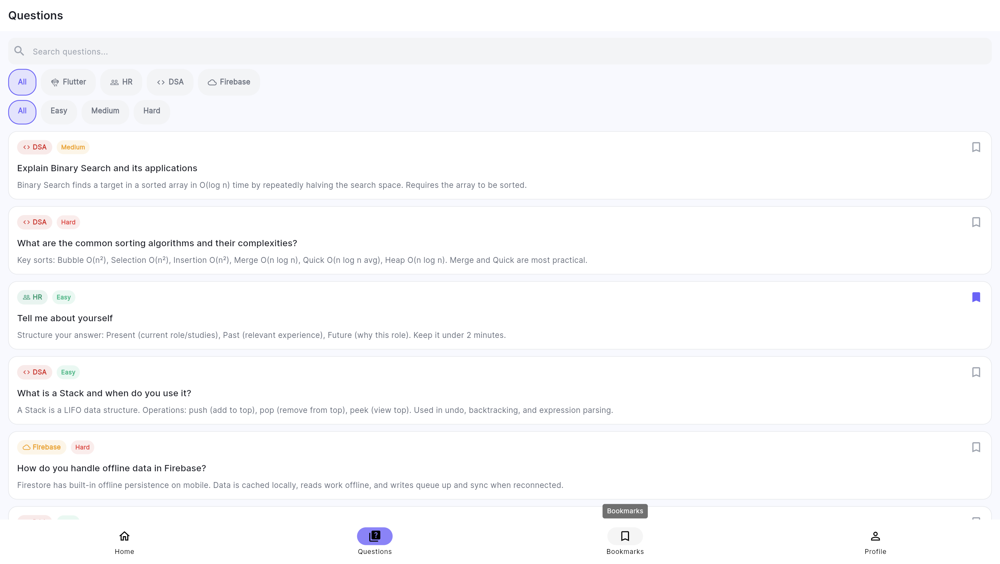
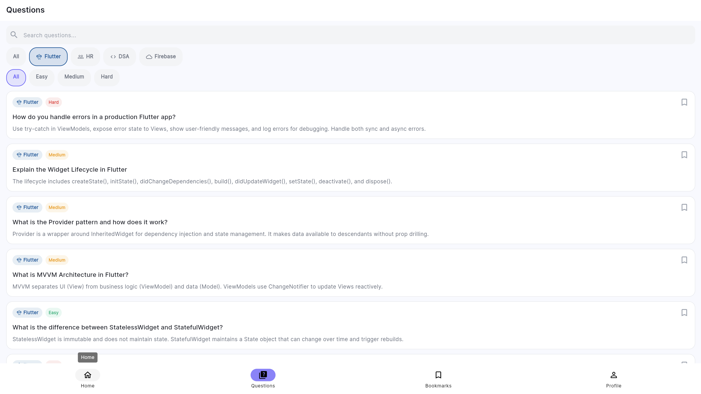
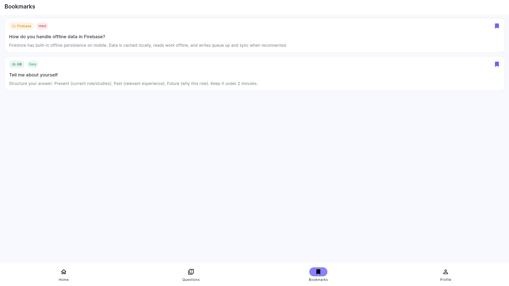
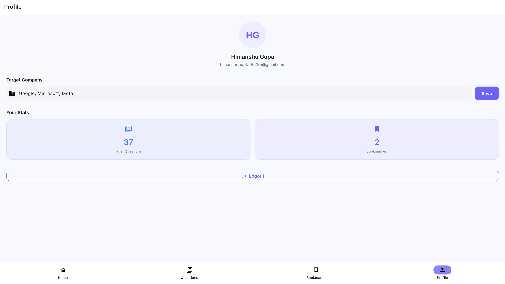
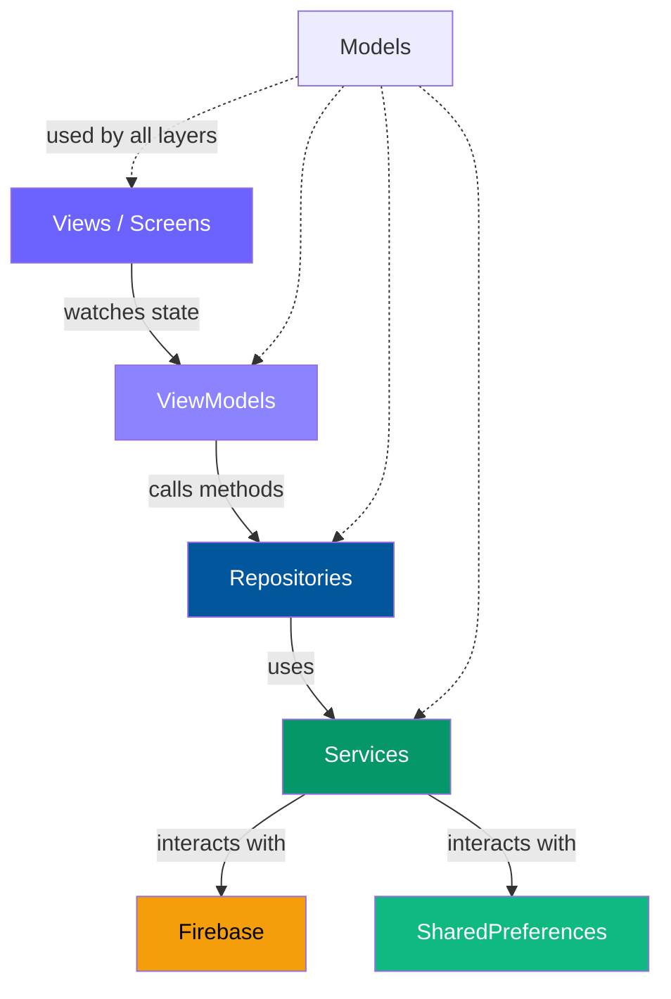

# 🎯 PrepAI

### AI-Powered Interview Preparation Application


> A polished, production-quality Flutter application that helps students prepare for technical interviews with curated questions, AI-powered answers, and progress tracking.

---

## ✨ Features

| Feature | Description |
|---------|-------------|
| 🔐 **Authentication** | Email sign-up, login, forgot password with Firebase Auth |
| 📊 **Dashboard** | Personalized greeting, progress tracking, recent questions |
| 📝 **Interview Questions** | 30+ curated questions across Flutter, HR, DSA, Firebase |
| 🔍 **Smart Filtering** | Search, category filter, difficulty filter |
| 🔖 **Bookmarks** | Save questions for later review, synced to cloud |
| 🤖 **AI Answers** | Get short summaries and detailed interview-ready answers |
| 👤 **Profile** | Track progress, set target company, manage account |
| 📱 **Responsive UI** | Modern, minimal design with loading/error/empty states |

---

## 📸 Screenshots

### Login Screen


### Dashboard Screen


### Questions Screen


### Bookmarks Screen


### Profile Screen


### Question Details Screen



---

## 🏗️ Architecture

This project follows the **MVVM (Model-View-ViewModel)** architecture pattern with a clear separation of concerns:



**Data Flow:**
```
User Action → View → ViewModel → Repository → Service → Firebase
                ↑                                         |
                └─────────── State Update ←──────────────┘
```

### Layer Responsibilities

| Layer | Responsibility | Example |
|-------|---------------|---------|
| **Views** | Render UI, forward user actions | `LoginScreen`, `DashboardScreen` |
| **ViewModels** | Hold UI state, call repositories | `AuthViewModel`, `QuestionsViewModel` |
| **Repositories** | Business logic, caching, coordination | `QuestionRepository` (filters, cache) |
| **Services** | Direct API/DB interaction | `AuthService`, `FirestoreService` |
| **Models** | Data structures, serialization | `QuestionModel`, `UserModel` |

---

## 🛠️ Tech Stack

| Technology | Purpose |
|-----------|---------|
| **Flutter** | Cross-platform UI framework |
| **Dart** | Programming language |
| **Firebase Auth** | User authentication |
| **Cloud Firestore** | NoSQL cloud database |
| **Provider** | State management |
| **go_router** | Declarative routing with auth guards |
| **SharedPreferences** | Local data persistence |
| **Google Fonts** | Modern typography (Inter) |

---

## 📁 Project Structure

```
lib/
├── main.dart                          # App entry point, Provider setup
├── app.dart                           # MaterialApp.router configuration
│
├── core/
│   ├── constants/
│   │   ├── app_colors.dart            # Centralized color palette
│   │   ├── app_strings.dart           # All user-facing strings
│   │   └── app_theme.dart             # Material 3 theme configuration
│   ├── routes/
│   │   └── app_router.dart            # go_router with auth redirects
│   └── utils/
│       └── helpers.dart               # Validators, formatters, utilities
│
├── models/
│   ├── user_model.dart                # User data model
│   ├── question_model.dart            # Question model with enums
│   └── bookmark_model.dart            # Bookmark relationship model
│
├── services/
│   ├── auth_service.dart              # Firebase Auth wrapper
│   ├── firestore_service.dart         # Firestore CRUD operations
│   ├── ai_service.dart                # Mock AI answer generation
│   └── storage_service.dart           # SharedPreferences wrapper
│
├── repositories/
│   ├── auth_repository.dart           # Auth + Firestore + Storage coordination
│   ├── question_repository.dart       # Questions with caching & filtering
│   ├── bookmark_repository.dart       # Bookmark management
│   └── user_repository.dart           # User profile operations
│
├── viewmodels/
│   ├── auth_viewmodel.dart            # Login, register, forgot password
│   ├── dashboard_viewmodel.dart       # Dashboard data aggregation
│   ├── questions_viewmodel.dart       # Question list with filters
│   ├── bookmark_viewmodel.dart        # Bookmark toggle & list
│   ├── ai_answer_viewmodel.dart       # AI answer generation
│   └── profile_viewmodel.dart         # User profile & stats
│
├── views/
│   ├── splash/splash_screen.dart      # Animated splash with auth check
│   ├── auth/
│   │   ├── login_screen.dart          # Login form
│   │   └── register_screen.dart       # Registration form
│   ├── dashboard/dashboard_screen.dart # Home dashboard
│   ├── questions/
│   │   ├── questions_screen.dart      # Question browser with filters
│   │   └── question_detail_screen.dart # Question detail + AI answer
│   ├── bookmarks/bookmarks_screen.dart # Saved questions
│   └── profile/profile_screen.dart    # User profile
│
├── widgets/
│   ├── custom_button.dart             # Reusable button with loading state
│   ├── custom_text_field.dart         # Styled input field
│   ├── question_card.dart             # Question list item card
│   ├── category_chip.dart             # Category filter chip
│   ├── loading_indicator.dart         # Loading spinner
│   ├── error_widget.dart              # Error state with retry
│   └── empty_state_widget.dart        # Empty state with CTA
│
└── seed_data.dart                     # Firestore question seeder
```

---

## 🚀 Getting Started

### Prerequisites

- [Flutter SDK](https://docs.flutter.dev/get-started/install) (3.8+)
- [Firebase CLI](https://firebase.google.com/docs/cli)
- [FlutterFire CLI](https://firebase.flutter.dev/docs/cli/)
- Android Studio / VS Code with Flutter extension

### Installation

1. **Clone the repository**
   ```bash
   git clone https://github.com/yourusername/prep_ai.git
   cd prep_ai
   ```

2. **Install dependencies**
   ```bash
   flutter pub get
   ```

3. **Set up Firebase**
   
   a. Create a new project in [Firebase Console](https://console.firebase.google.com/)
   
   b. Enable **Email/Password** authentication:
      - Firebase Console → Authentication → Sign-in method → Email/Password → Enable
   
   c. Create **Cloud Firestore** database:
      - Firebase Console → Firestore Database → Create database → Start in test mode
   
   d. Configure FlutterFire:
      ```bash
      flutterfire configure
      ```
   
   e. Deploy security rules:
      ```bash
      firebase deploy --only firestore:rules
      ```

4. **Seed interview questions**
   ```bash
   dart run lib/seed_data.dart
   ```

5. **Run the app**
   ```bash
   flutter run
   ```

---

## 🗃️ Firebase Structure

```
Firestore Database
│
├── users/{userId}
│   ├── name: string
│   ├── email: string
│   ├── targetCompany: string
│   └── createdAt: timestamp
│
├── questions/{questionId}
│   ├── title: string
│   ├── category: string (flutter|hr|dsa|firebase)
│   ├── difficulty: string (easy|medium|hard)
│   ├── shortAnswer: string
│   └── detailedAnswer: string
│
└── bookmarks/{bookmarkId}
    ├── userId: string
    ├── questionId: string
    └── createdAt: timestamp
```

---

## 🔒 Security Rules

- **Default deny** — All paths denied unless explicitly allowed
- **Users** — Can only read/write their own document
- **Questions** — Read-only for authenticated users
- **Bookmarks** — Users can only create/read/delete their own bookmarks

---

## 🎨 Design Decisions

1. **MVVM over MVC** — Better separation of UI and business logic, more testable
2. **Provider over Bloc** — Simpler API, less boilerplate, officially recommended
3. **go_router over Navigator** — Declarative routing, auth guards, web-ready
4. **Mock AI Service** — Demonstrates architecture without API key management; swappable with real API
5. **Client-side filtering** — Questions are cached locally for instant search/filter UX

---

## 🤝 Contributing

1. Fork the project
2. Create your feature branch (`git checkout -b feature/amazing-feature`)
3. Commit your changes (`git commit -m 'Add amazing feature'`)
4. Push to the branch (`git push origin feature/amazing-feature`)
5. Open a Pull Request

---

## 📄 License

This project is licensed under the MIT License.

---

## 👤 Author

**Himanshu**


- LinkedIn: [Your LinkedIn] [https://www.linkedin.com/in/himanshu-gupta-383a6b220/]

---

<p align="center">
  Built using Flutter & Firebase
</p>
